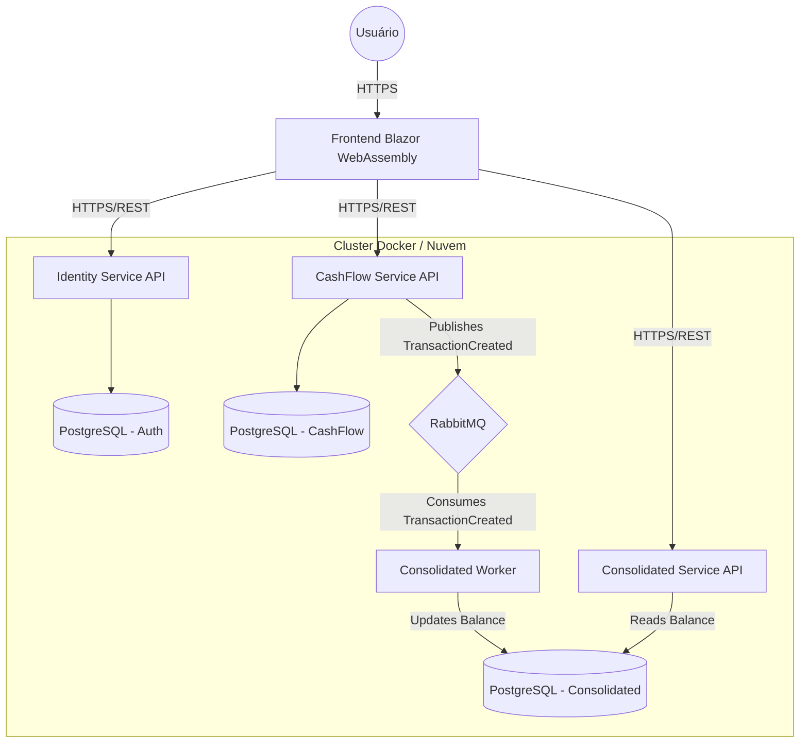

# Arquitetura da Solução

## Visão Geral

A solução adota uma arquitetura de **Microsserviços** baseada em eventos (Event-Driven Architecture), garantindo desacoplamento, escalabilidade e resiliência, conforme solicitado nos requisitos. O sistema é composto por serviços autônomos que se comunicam de forma assíncrona para processamento de negócios e síncrona para leitura de dados.

## Diagrama de Componentes (C4 Model - Container Level Simplificado)

## Padrões Adotados

### 1. Domain-Driven Design (DDD)
Cada serviço possui sua própria camada de Domínio, isolada e pura.
- **Camadas**:
    - `Domain`: Entidades, Value Objects, Interfaces de Repositório.
    - `Application`: Casos de uso (Services/Handlers), DTOs.
    - `Infrastructure`: Implementação de persistência (EF Core), Mensageria (MassTransit).
    - `API`: Controllers, Middlewares, Configuração.

### 2. SOLID & Clean Code
- Injeção de Dependência.
- Single Responsibility Principle em todas as classes.
- Código auto-explicativo, com nomes de métodos e variáveis semânticos.

### 3. Event-Driven Architecture (EDA)
- Comunicação assíncrona entre o serviço Transacional (`CashFlow`) e o Relatório (`Consolidated`) para garantir que o lançamento nunca falhe se o relatório estiver fora do ar.
- **Resiliência**: Uso de filas (RabbitMQ) garante que mensagens sejam processadas eventualmente.

## Decisões Técnicas

- **Framework**: .NET 8+.
- **ORM**: Entity Framework Core (Code First).
- **Mensageria**: MassTransit (Abstração robusta sobre RabbitMQ).
- **Frontend**: Blazor WebAssembly para SPA rica e performática em C#.
- **Banco de Dados**: PostgreSQL (containers isolados ou schemas separados).
- **Testes**: xUnit + Moq + FluentAssertions.
